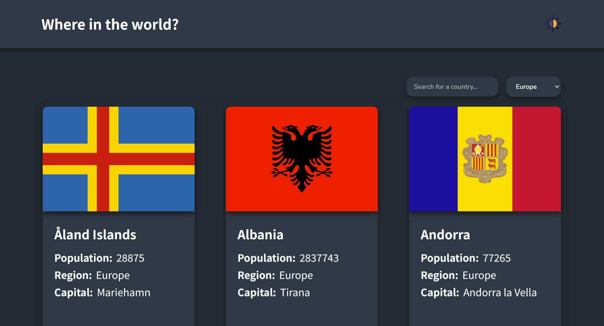
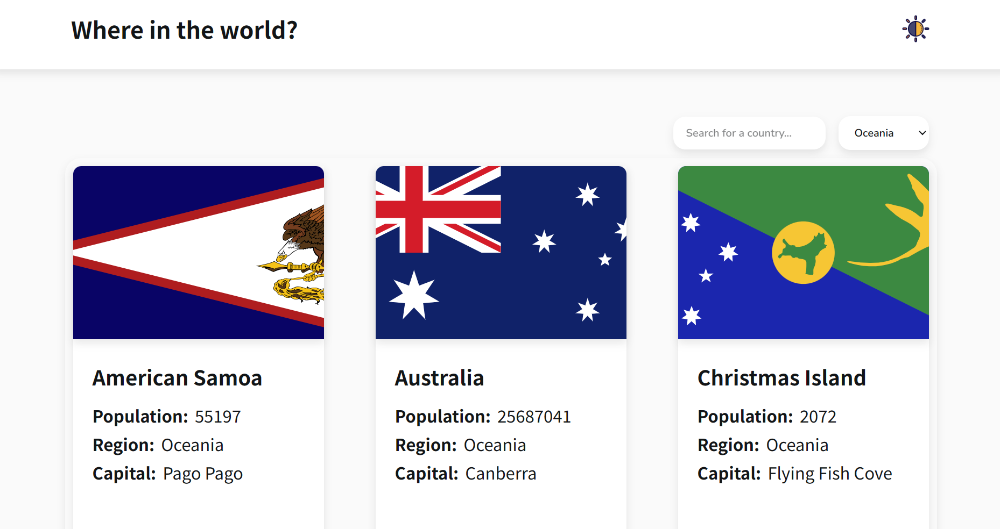

# Where-in-the-world

A responsive web application that pull data from the REST Countries API and displays it in a splendid layout.

## Table of contents

- [Overview](#overview)
- [Screenshot](#screenshot)
- [Links](#links)
- [My process](#my-process)
- [Built with](#built-with)

## Overview

- Where in the world app is a react application built to search and display information of countries.
- I built this project using frontend mentor (a platform that provides aspiring front-end developers with project designs so that you can practice your front-end skills using a real-life workflow). 

The users are able to:

- See countries from the API on the homepage
- Search for a country using an input field
- Filter countries by region
- Click on a country to see more detailed information on a separate page
- View the optimal layout for the interface depending on their device's screen size
- Toggle the color scheme between light and dark mode

### Screenshot

### Links

- Solution URL: [Github](https://github.com/21-raghav/Where-in-the-world)
- Live Site URL: [Live Site](https://where-in-the-world-mocha.vercel.app/)

## My process

- created a router using react router, added three routes each for root page, home page and detail page.
- created multiple independent components for header, input and filter field, countries list, list item and detail page. 
- uses REST countries API to get the data to display.
- memoize the data extracted to improve performance of the app.
- uses states, refs react features. 
- implemented theme switch to play between light and dark theme. 

### Built with

- React (Router)
- JavaScript
- Semantic HTML5 markup
- CSS3, CSS modules
- Create-react-app
- Deployed on Firebase
